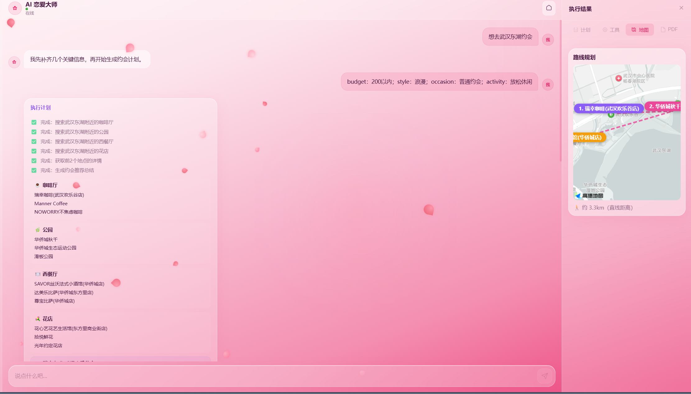

<!--
╔══════════════════════════════════════════════════════════════════════╗
║  DreamSeed 种梦计划 — AI创造者大赛  官方 README 模板                ║
║                                                                      ║
║  使用说明：                                                          ║
║  1. 将本模板放在参赛仓库根目录 README.md 的顶部                       ║
║  2. 头图使用 DreamField 官方公开活动图片地址                         ║
║  3. 请保留 DREAMFIELD_README_HEADER_START / END 标识                 ║
║  4. 分割线以下供创作者自由编写项目内容                               ║
╚══════════════════════════════════════════════════════════════════════╝
-->

<!-- DREAMFIELD_README_HEADER_START -->

<p align="center">
  <a href="https://www.dreamfield.top">
    
  </a>
</p>

<!-- DREAMFIELD_README_HEADER_END -->
# 💕 LoveAgent — AI 恋爱大师

> 基于 **Spring Boot 3.4 + LangChain4j + LangGraph4j + MCP** 的 AI Agent 约会规划系统。
> Plan-and-Execute 架构 + 高德地图 MCP 工具链 + RAG 知识库 + LLM 驱动自然语言修改。

## 📸 预览

| 首页 | Agent 执行面板 |
|------|---------------|
|  |  |

## 🧠 核心架构

```
用户自然语言 ──→ 意图路由 ──→ ┌─ chat ──→ RAG 知识库检索 + SSE 流式回复
                              │
                              └─ plan ──→ Planner Node (LLM 拆解步骤)
                                           │
                                           ▼
                                         Executor Node
                                    ┌──────────────────┐
                                    │  高德 MCP 工具链   │
                                    │  · mapsGeo        │
                                    │  · aroundSearch   │
                                    │  · searchDetail   │
                                    │  · walkingRoute   │
                                    │  · WebScraping    │
                                    └──────┬───────────┘
                                           ▼
                                    地图路线 + PDF 计划书
```

## ✨ 后端技术亮点

### 1. Plan-and-Execute Agent（LangGraph4j）

| 特性 | 实现 |
|------|------|
| 图结构 | **LangGraph4j** `StateGraph` — Planner → Executor 循环，`PlanExecuteState` 状态传递 |
| 计划拆解 | LLM 根据约会需求（地点/预算/风格/活动）自动生成 N 步执行计划 |
| 上下文累积 | 每一步结果追加到 `accumulatedContext`，后续步骤感知前置结果 |
| 自动路由 | `isFinalizeStep()` 精准识别搜索/详情/生成步骤，分流到不同执行路径 |
| 迭代终止 | `MAX_ITINERARY_POIS=3` 控制行程点数量，`candidatesByKeyword` 跨步骤去重 |

```
PlannerNode                    ExecutorNode (循环)
    │                               │
    ├─ LLM 生成计划步骤              ├─ executeStepDirectly()
    │  ["搜索咖啡厅","搜索公园",     │   ├─ 高德 MCP 定位 (mapsGeo)
    │   "搜索甜品店","生成总结"]     │   ├─ POI 搜索 (aroundSearch)
    │                               │   ├─ 详情获取 (searchDetail)
    └───────────────────────────────┤   └─ 网页抓取 (WebScrapingTool)
                                    │
                                    └─ emitMapAndPdf()
                                       ├─ walkingRoute → 地图路线
                                       └─ PdfGenerationTool → PDF 计划书
```

### 2. MCP 工具集成

基于 LangChain4j `@Tool` 注解 + 高德 MCP Server，LLM 自主决策调用：

| 工具 | 用途 | 调用方式 |
|------|------|----------|
| `mapsGeo` | 地址 → 经纬度 | Executor 直接调用 |
| `mapsAroundSearch` | 周边 POI 搜索（关键词+半径） | Executor 直接调用 |
| `mapsSearchDetail` | POI 详情（评分/营业时间/图片） | Executor 直接调用 |
| `mapsWalkingRoute` | 步行路径规划（距离/时长） | emitMapAndPdf 调用 |
| `WebScrapingTool` | Jsoup 抓取百度搜索补充信息 | finalize 阶段调用 |
| `PdfGenerationTool` | Thymeleaf 模板 → Flying Saucer PDF | 最终阶段调用 |

### 3. SSE 事件流体系

**POST SSE + ReadableStream** 消费模式（EventSource 仅支持 GET）：

| SSE Event | 触发时机 | 前端路由 |
|-----------|----------|----------|
| `plan` | Planner 生成步骤列表 | 面板展开 + 计划 Tab |
| `step` | 每步开始/完成（含 duration） | 步骤时间线 + 工具调用卡片 |
| `section` | POI 搜索结果 | 工具 Tab POI 列表 |
| `map` | 路线生成完成 | 地图 Tab (高德 JS API) |
| `pdf` | PDF 生成完成 | PDF Tab (iframe 预览) |
| `form` | 信息不完整需补全 | 动态表单弹窗 |
| `text` | LLM 文字回复 | 聊天气泡 |

### 4. LLM 驱动的自然语言修改

传统方案：用户点按钮 → 弹出选择器 → 选 POI → 确认修改。  
**本项目**：Agent 面板激活后，用户直接打字，LLM 理解意图 + 自主决策操作类型：

| 操作 | 示例 | 后端行为 |
|------|------|----------|
| `replace` | "把咖啡厅换成茶馆" | 高德搜索茶馆 → 替换 → 重新生成地图+PDF |
| `remove` | "取消第三个点" | 按索引删除 → 重新生成 |
| `add` | "加一个花店" | 高德搜索 → 追加 → 重新生成 |
| `regenerate` | "重新生成下PDF" | 保留当前 POIs → 仅重生成 |
| `retry` | "不满意，换个风格重新来" | 带反馈走完整 Plan-and-Execute |

### 5. RAG 混合检索管线

```
文档（56 Q&A，3 篇 MD）
  ↓ #### 标题切分 (RecursiveCharacterTextSplitter)
  ↓ text-embedding-v3 (1536d) → pgvector HNSW 索引
  ↓
用户提问
  ↓ 向量检索 70% + BM25 关键词 30%
  ↓ Top10 → gte-rerank-v2 精排 → Top3
  ↓ 注入 System Prompt + 参考链接
  ↓ qwen-plus 流式回复
```

### 6. 意图路由

```
用户消息 ──→ classifyIntent()
              ├─ 关键词匹配（约会/帮我规划/附近/想去...）
              │   └─ "plan" → Agent 流程
              └─ 默认
                  └─ "chat" → RAG + 普通对话
```

## 🛠️ 技术栈

### 后端
| 技术 | 用途 |
|------|------|
| **Java 21** | 运行时（虚拟线程、记录类） |
| **Spring Boot 3.4** | 应用框架 |
| **LangChain4j 1.0-beta3** | AI 框架（Chat/Embedding/Tool） |
| **LangGraph4j** | Agent 图编排（Plan-and-Execute） |
| **DashScope (阿里百炼)** | qwen-plus 对话 + text-embedding-v3 + gte-rerank-v2 |
| **PostgreSQL 16 + pgvector** | 关系存储 + 向量检索（HNSW） |
| **MCP (高德地图)** | 地理编码/POI搜索/路径规划/详情 |
| **JSoup** | 网页抓取 |
| **Flying Saucer + Thymeleaf** | PDF 生成 |
| **Docker** | pgvector 部署 |

### 前端
| 技术 | 用途 |
|------|------|
| **Vue 3 + Vite** | SPA 框架 |
| **高德 JS API 2.0** | 地图渲染 + 步行路线 |
| **SSE ReadableStream** | POST SSE 事件消费 |
| **Glassmorphism CSS** | 樱花粉玻璃态视觉 |

## 📦 项目结构

```
loveagent/
├── src/main/java/com/aichat/app/
│   ├── graph/                     # LangGraph4j Agent 图
│   │   ├── PlanExecuteGraph.java  # 图定义
│   │   ├── PlanExecuteState.java  # 状态 schema
│   │   └── nodes/
│   │       ├── PlannerNode.java   # LLM 拆解步骤
│   │       └── ExecutorNode.java  # MCP 工具执行
│   ├── controller/
│   │   └── ChatController.java    # REST + SSE (route-intent/love-stream/modify-stream)
│   ├── service/
│   │   ├── LoveAgentService.java  # Agent 编排 + 意图分类
│   │   ├── ChatService.java       # 普通对话
│   │   ├── RagService.java        # 混合检索 + Rerank
│   │   └── PlanExecuteRunner.java # 图执行器
│   ├── tools/
│   │   ├── AmapTools.java         # 高德 MCP 封装
│   │   ├── DatePlanTools.java     # 约会规划工具
│   │   ├── PdfGenerationTool.java # PDF 生成
│   │   ├── WebScrapingTool.java   # 网页抓取
│   │   ├── WebSearchTool.java     # Web 搜索
│   │   └── AgentToolRegistry.java # 工具注册中心
│   └── model/                     # JPA 实体 + Repository
│
├── yu-ai-agent-frontend/          # Vue 3 前端
│   └── src/
│       ├── views/ChatPage.vue     # SSE 路由 + 双栏布局
│       ├── components/
│       │   ├── ResultPanel.vue    # 计划/工具/地图/PDF Tab
│       │   ├── RouteMap.vue       # 高德地图
│       │   ├── ChatPanel.vue      # 聊天气泡
│       │   └── MessageBubble.vue  # 多类型消息渲染
│       └── utils/sse.js           # ReadableStream SSE 解析
│
└── docs/superpowers/              # 设计文档 + 实现计划
```

## 🚀 快速开始

```bash
# 1. 启动 PostgreSQL
docker start pgvector

# 2. 启动后端 (port 8123)
./mvnw spring-boot:run

# 3. 启动前端 (port 3000)
cd yu-ai-agent-frontend && npm run dev
```

> 需要 `DASHSCOPE_API_KEY` 环境变量或 `application.yml` 中的 `ai.dashscope.api-key`

## 📡 API

| 方法 | 路径 | 说明 |
|------|------|------|
| POST | `/api/chat/route-intent` | 意图路由（chat/plan） |
| POST | `/api/chat/love-stream` | Agent 流式执行 (SSE) |
| POST | `/api/chat/modify-stream` | LLM 驱动自然语言修改 (SSE) |
| POST | `/api/chat/regenerate` | 重新生成路线+PDF |
| GET | `/api/chat/pdf/{filename}` | PDF 下载/预览 |
| GET/POST/DELETE | `/api/chat/conversations` | 对话 CRUD |
| GET | `/api/chat/conversations/{id}/messages` | 历史消息 |

## 📄 License

MIT
